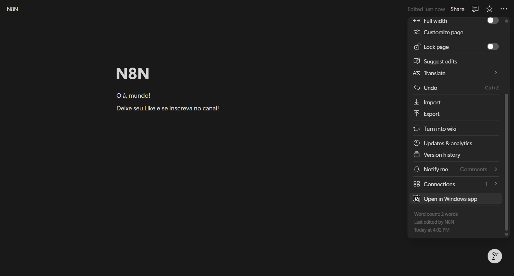

# 🚀 Integração n8n + Notion — Atualização Periódica de Blocos

Este repositório contém um fluxo de automação utilizando **n8n** e **Notion**, com o objetivo de atualizar dinamicamente blocos em uma página do Notion a cada segundo. É ideal para quem deseja integrar essas ferramentas de forma simples, funcional e totalmente personalizável.

---

## 📂 Arquivos incluídos

| Arquivo/Imagem | Descrição |
|----------------|-----------|
| `atualizar-bloco-notion-cada-1s.json` | Fluxo completo exportado do n8n |
| `n8n-fluxo-basico-notion.png` | Visualização do fluxo básico no editor do n8n |
| `noção-pagina-olá-mundo.png` | Exemplo da página inicial no Notion |
| `01 - Editor do Fluxo Agendado (n8n + Notion).png` | Configuração do gatilho agendado |
| `02 - Execuções do Workflow no n8n (Logs).png` | Logs das execuções automáticas |
| `03 - Conteúdo Gerado no Notion pelo Fluxo.png` | Resultado final visível no Notion |

---

## 📌 O que essa automação faz?

- Utiliza um **gatilho agendado** no n8n para disparar o fluxo a cada segundo
- Gera ou atualiza dinamicamente o conteúdo de um bloco no Notion
- Ideal para testes, dashboards, contadores e conteúdo dinâmico

---

## 🧠 Pré-requisitos

- Conta ativa no [n8n](https://n8n.io/)
- Banco de dados ou página já criada no [Notion](https://notion.so/)
- Credenciais da integração com a API do Notion (token + ID da página/bloco)

---

## 🛠️ Como utilizar

1. Importe o arquivo `atualizar-bloco-notion-cada-1s.json` no n8n
2. Configure suas credenciais da API do Notion
3. Substitua os campos de `pageId`, `token` e `conteúdo` conforme necessário
4. Ative o fluxo e observe as atualizações automáticas em tempo real

---

## 💡 Casos de uso

- Simulação de dashboards dinâmicos
- Atualização de contadores em tempo real
- Logs de testes de integração
- Estudo prático de webhooks e APIs

---

## 🖼️ Ilustrações do Projeto

### Fluxo no n8n

### Página de destino no Notion

### Etapas do Fluxo
1. 
2. 
3. 

---

## ✍️ Autoria

Este projeto foi desenvolvido e documentado por **Clara Moura**.  
Fique à vontade para contribuir ou adaptar o fluxo ao seu caso!

---

## 📃 Licença

Este projeto está sob a licença MIT. Veja o arquivo [LICENSE](LICENSE) para mais detalhes.
